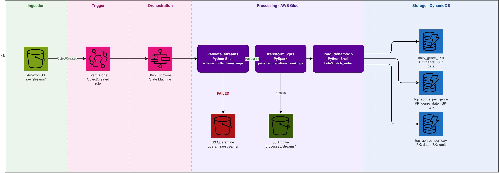

# Music Streaming ETL Pipeline

Near-real-time ETL pipeline that ingests music streaming event files from S3,
validates and transforms them with AWS Glue, computes daily KPIs per genre,
and loads results into DynamoDB. Orchestrated by AWS Step Functions and
triggered by S3 PutObject events via EventBridge.

---

## Architecture



> Source: [`docs/architecture.drawio`](docs/architecture.drawio) — open in [draw.io](https://app.diagrams.net) to edit.

---

## KPIs computed (daily, per genre)

| KPI | Table |
|---|---|
| Listen count | `daily_genre_kpis` |
| Unique listeners | `daily_genre_kpis` |
| Total listening time | `daily_genre_kpis` |
| Avg listening time per user | `daily_genre_kpis` |
| Top 3 songs per genre | `top_songs_per_genre` |
| Top 5 genres by listen count | `top_genres_per_day` |

---

## Folder layout

| Path | Purpose |
|---|---|
| `terraform/` | All AWS resources (S3, DynamoDB, IAM, Glue, Step Functions, EventBridge) |
| `glue_jobs/` | Python source for the three Glue jobs — uploaded to S3 by `deploy.sh` |
| `step_functions/` | State machine definition (ASL JSON) |
| `scripts/` | Helper scripts: deploy, upload sample data, local PySpark sanity check |
| `docs/` | Architecture diagram (draw.io), DynamoDB schema, sample queries |

---

## Quick start

```bash
# 1. Set your AWS profile
export AWS_PROFILE=mubarak-admin

# 2. Provision infrastructure
cd terraform
terraform init
terraform plan
terraform apply

# 3. Upload Glue scripts and sample data
cd ..
./scripts/deploy.sh
./scripts/upload_sample_data.sh

# 4. Drop a streams file into S3 to trigger the pipeline
aws s3 cp ../data/streams/streams1.csv s3://<bucket>/raw/streams/streams1.csv

# 5. Monitor execution in the Step Functions console,
#    then query DynamoDB once the run completes
```

---

## Build status

| Step | Status |
|---|---|
| 1. Scaffold project structure | ✅ |
| 2. DynamoDB schema design | ✅ |
| 3. Terraform — S3, DynamoDB, IAM | ✅ |
| 4. Glue validation job | ✅ |
| 5. Glue transform job (PySpark) | ✅ |
| 6. Glue DynamoDB load job | 🔄 |
| 7. Step Functions + EventBridge | ⬜ |
| 8. Deploy scripts + docs | ⬜ |
| 9. Local PySpark verification | ⬜ |
